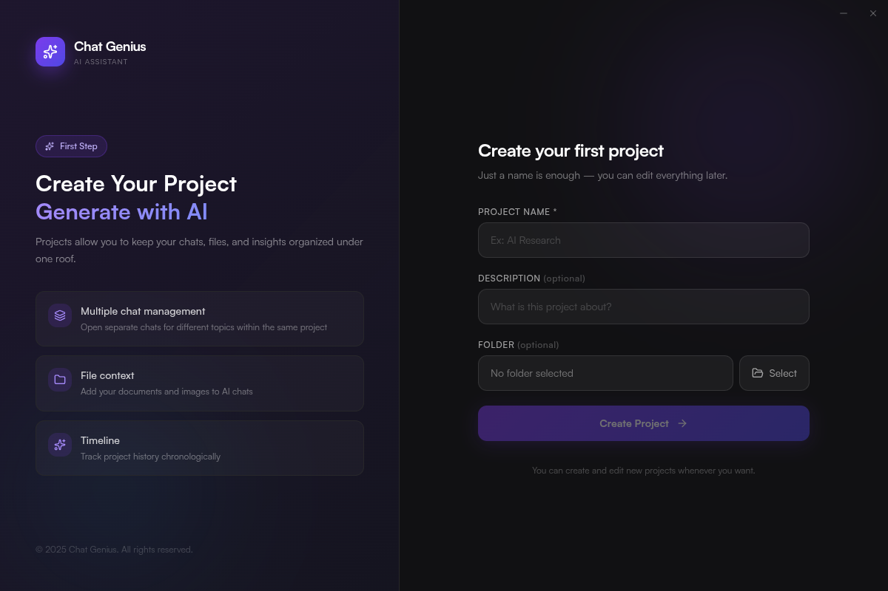
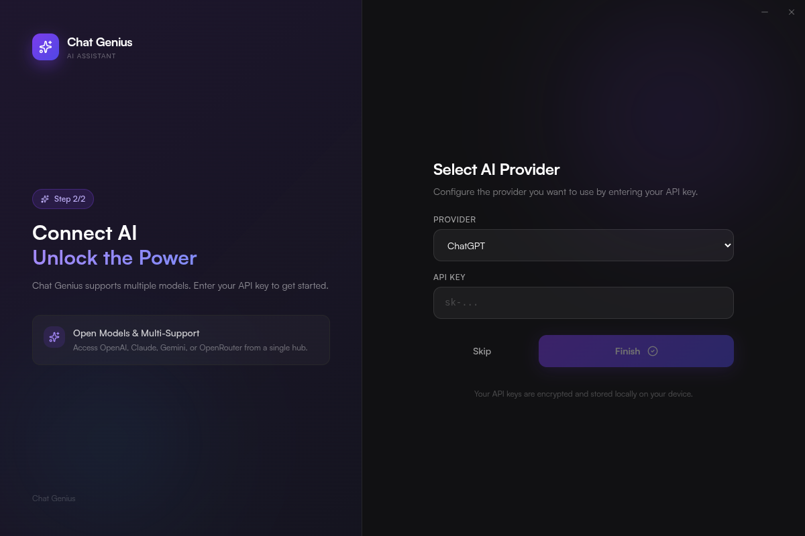
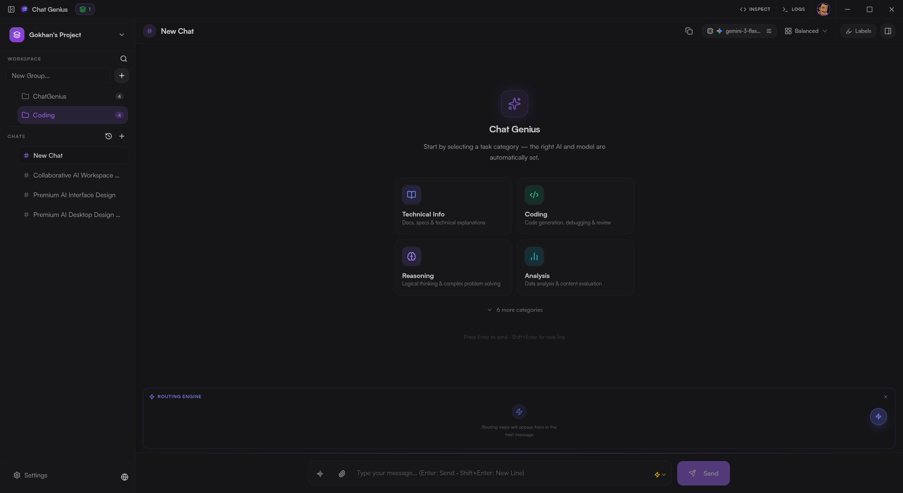
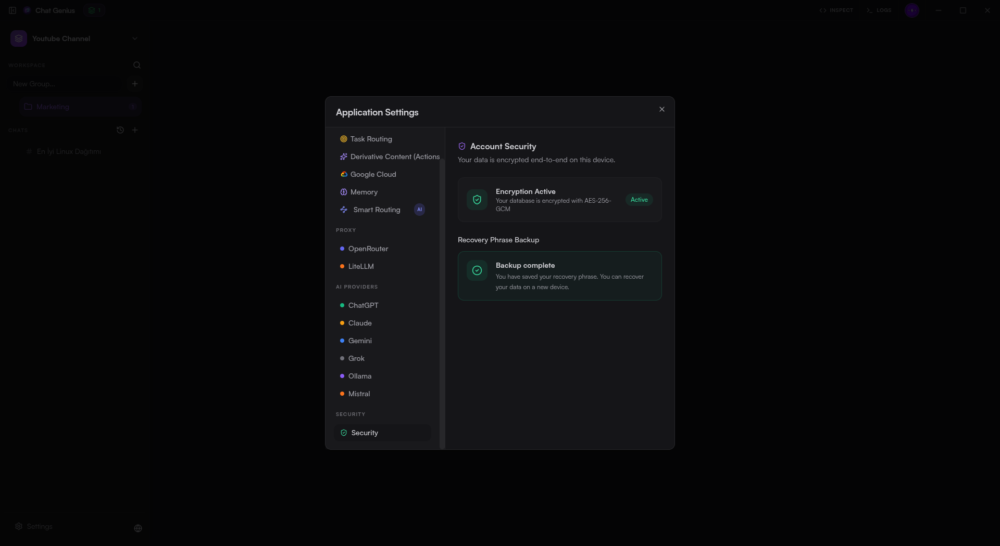
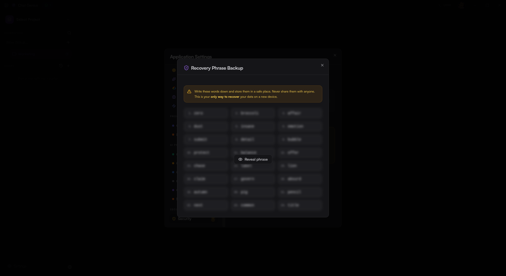
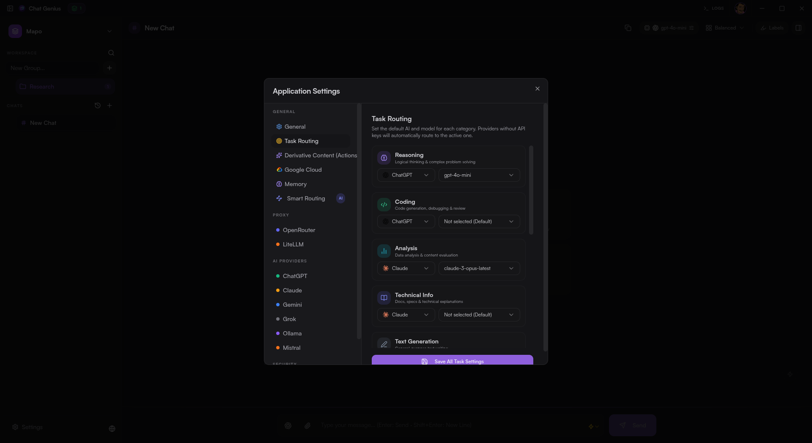

  # 🤖 ChatGenius AI Desktop Application

  **All AI Models in One Place, Under Your Control.**

  
  
  
  

   

  

   
   

  [Download for Windows](https://github.com/GokhanKR/chatgenius-ai-app/releases/latest) •
  ~~[Download for macOS]~~ *(Coming Soon)* •
  [Download for Linux](https://github.com/GokhanKR/chatgenius-ai-app/releases/latest)

---

## ✨ Why ChatGenius AI?

ChatGenius is designed to accelerate your daily workflow. It brings together OpenAI, Google Gemini, Anthropic (Claude), HuggingFace, and even your locally running models (like Ollama) into a single, elegant interface.

*   🧠 **Advanced Model Routing:** Our AI engine automatically selects the best model for your prompt, or strictly follows the model you have pinned.
*   🔒 **Ultimate Privacy & Encryption:** Your chat history and API keys never leave your device; they are securely stored with **military-grade (SQLCipher)** encryption.
*   ☁️ **Cloud Sync:** Seamlessly sync your chats across all your devices using your own Google Cloud account.
*   ⚡ **Fast & Modern UI:** Fluid animations, beautiful dark/light modes, and a distraction-free workspace.

 

## 📥 Download Now

Installing the app is incredibly easy. Click the link that matches your operating system:

### 🪟 Windows (.exe)
👉 **[Download Windows Version](https://github.com/GokhanKR/chatgenius-ai-app/releases/latest)**
*After downloading, simply double-click the `.exe` file to install.*

### 🍎 macOS (.dmg)
👉 **Coming Soon!**
*We are working hard to bring ChatGenius AI to macOS. Stay tuned for updates.*

### 🐧 Linux (.AppImage / .deb)
👉 **[Download Linux Version](https://github.com/GokhanKR/chatgenius-ai-app/releases/latest)**
*Right-click the AppImage file, check "Allow executing file as program", and run it directly.*

 

## 📸 Screenshots

<b>Advanced Chat Interface (Click to expand)</b>

 

  

  

<b>Model Settings & Encryption (Click to expand)</b>

 

  

  

 

---

  
Built securely and with ❤️.

   
  

